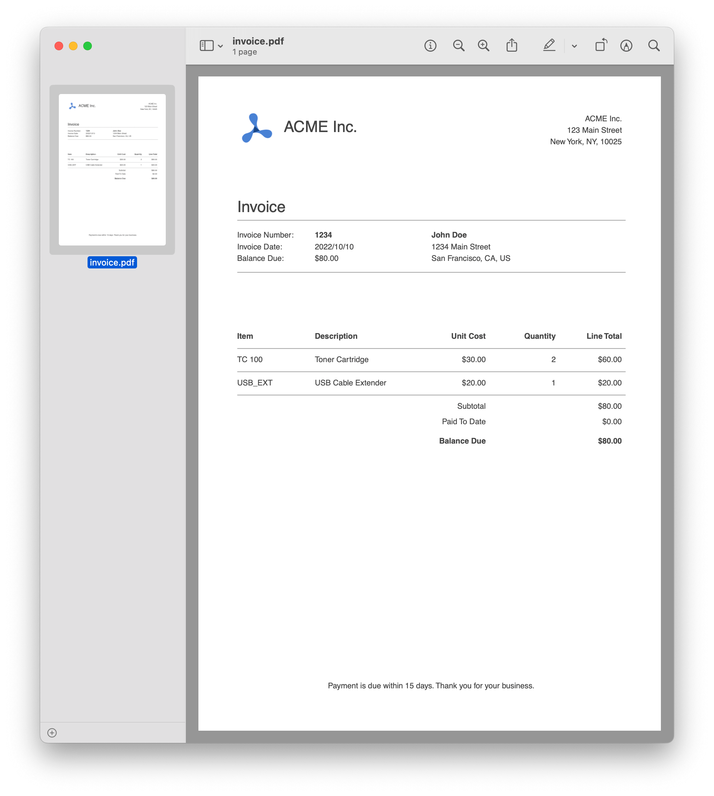

# PDFKit Invoices

  

## Prerequisites

- [Node.js](http://nodejs.org/) (with npm or Yarn)

## Getting Started

This repository is an example of how to make PDF invoices with PDFKit.

There are two important fields in this this repository:

- [`index.js`](index.js) is the main entry point. It defines the data structure used to create the invoices.
- [`createInvoice.js`](createInvoice.js) exports a function that can be used to create invoice PDFs.

To learn more about this project, make sure to read the accompanying [blog post](https://pspdfkit.com/blog/2019/generate-invoices-pdfkit-node)

## Contributing

Please ensure
[you have signed our CLA](https://pspdfkit.com/guides/web/current/miscellaneous/contributing/) so that we can
accept your contributions.
